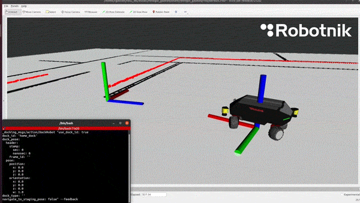

<a id="readme-top"></a>


<!-- PROJECT SHIELDS -->
[![Contributors][contributors-shield]][contributors-url]
[![Forks][forks-shield]][forks-url]
[![Stargazers][stars-shield]][stars-url]
[![Issues][issues-shield]][issues-url]
<!-- [![Unlicense License][license-shield]][license-url] -->
[![LinkedIn][linkedin-shield]][linkedin-url]


<!-- PROJECT LOGO -->
<br />
<div align="center">
  <a href="https://github.com/RobotnikAutomation/robot_simulation">
    
  </a>
=======

  <h3 align="center">robot_simulation</h3>

  <p align="center">
    Simulation of Robotnik Automation robots in ROS2!
    <br />
    <a href="https://github.com/RobotnikAutomation/robot_simulation"><strong>Explore the docs »</strong></a>
    <br />
    <br />
    <a href="#enjoy">View Demo</a>
    &middot;
    <a href="https://github.com/RobotnikAutomation/robot_simulation/issues/new?labels=bug&template=bug-report---.md">Report Bug</a>
    &middot;
    <a href="https://github.com/RobotnikAutomation/robot_simulation/issues/new?labels=enhancement&template=feature-request---.md">Request Feature</a>
  </p>
</div>


<!-- TABLE OF CONTENTS -->
<details>
  <summary>Table of Contents</summary>
  <ol>
    <li>
      <a href="#about-the-project">About The Project</a>
    </li>
    <li>
      <a href="#getting-started">Getting Started</a>
      <ul>
        <li><a href="#prerequisites">Prerequisites</a></li>
        <li><a href="#installation">Installation</a></li>
      </ul>
    </li>
    <li>
        <a href="#usage">Usage</a>
      <ul>
        <li>
            <a href="#gazebo-classic">Gazebo Classic</a>
        <ul>
            <li><a href="#launch-gazebo">Launch Gazebo</a></li>
            <li><a href="#spawn-robot">Spawn Robot</a></li>
            <li><a href="#control-the-robot">Control the Robot</a></li>
        </ul>
        </li>
      </ul>
    </li>
    <li>
        <a href="#custom-simulation">Custom Simulation</a>
      <ul>
        <li><a href="#custom-robot-model">Custom Robot Model</a></li>
        <li><a href="#custom-world">Custom World</a></li>
        <li><a href="#custom-control">Custom Control</a></li>
      </ul>
    </li>
    <li><a href="#roadmap">Roadmap</a></li>
    <li><a href="#contributing">Contributing</a></li>
    <li><a href="#license">License</a></li>
    <li><a href="#contact">Contact</a></li>
  </ol>
</details>


<!-- ABOUT THE PROJECT -->
## About The Project

[![Simulation View][product-screenshot]](https://github.com/RobotnikAutomation/robot_simulation)

This package will combine the different Robotnik packages in ROS2 to simulate the robots in the different available platforms, as Gazebo Classic, Gazebo Ignition, etc.

This README will guide you to the simulation usage and the custom simulations that you can build for your own projects.

<p align="right">(<a href="#readme-top">back to top</a>)</p>

<!-- GETTING STARTED -->
## Getting Started

This package works with the different packages that Robotnik developed for the robots. You will need to install some of these packages first.

### Prerequisites

First, be sure that you have all the [Gazebo packages](https://classic.gazebosim.org/tutorials?tut=ros2_installing) installed for ROS2.

```sh
sudo apt install ros-humble-gazebo-ros-pkgs
```

### Installation

Then, let's procede with the installation of the Robotnik packages.

1. Init the submodules of this repository
    ```sh
    git submodule init && git submodule update
    ```

2. Install robotnik_controller dependencies
   ```sh
   sudo dpkg -i debs/*.deb
   ```


<p align="right">(<a href="#readme-top">back to top</a>)</p>


<!-- USAGE EXAMPLES -->
## Usage

### Gazebo Classic

#### Launch Gazebo

Init the Gazebo world by launching:

```sh
ros2 launch robotnik_gazebo_classic spawn_world.launch.py
```

There are some arguments that allows you to change the world, in case that you want to use a custom world.


| Arguments  | Default    | Description                                                                                                 |
|------------|------------|-------------------------------------------------------------------------------------------------------------|
| world      | demo       | This arguments selects a world in  [ worlds ](robotnik_gazebo_classic/worlds/)  folder. |
| world_path | demo.world | In the case that you have your own world to simulate, introduce the path to the world file.                 |.

Example:
```sh
ros2 launch robotnik_gazebo_classic spawn_world.launch.py world:=maze
```


#### Spawn Robot

Once you have the simulation running, you can spawn the robot in the world. For that, there is a launch file that starts all the nodes.

```sh
ros2 launch robotnik_gazebo_classic spawn_robot.launch.py
```
| Arguments        | Default                      | Description                                                                                    |
|------------------|------------------------------|------------------------------------------------------------------------------------------------|
| namespace        | robot                        | namespace that will be in the nodes and topics and differenciate one robot entity from another |
| robot            | rbkairos                     | robot type desired to be spawned                                                               |
| robot_model      | _value of robot argument_              | robot_model variation of the robot type. For using this argument, robot has to be fulfilled    |
| robot_xacro_path | rbkairos/rbkairos.urdf.xacro | path to a xacro model if it is not included in the robot_description package        |
| x                | 0.0                          | position x in the Gazebo world to spawn the robot                                              |
| y                | 0.0                          | position y in the Gazebo world to spawn the robot                                              |
| z                | 0.0                          | position z in the Gazebo world to spawn the robot                                              |

With the arguments described above, the launcher creates the robot that you want in Gazebo. As default, it will spawn a RBKairos robot, but you can changed by:

- rbvogui
- rbtheron
- rbsummit
- rbkairos

Example:
```sh
ros2 launch robotnik_gazebo_classic spawn_robot.launch.py robot:=rbvogui
```

In case that your robot has a variation (check [robots](robotnik_pkgs/robot_description/robots/) folder in robot_description package), you can select it by the argument **robot_model**.

Example:
```sh
ros2 launch robotnik_gazebo_classic spawn_robot.launch.py robot:=rbkairos robot_model:=rbkairos_ur
```

Then, the arguments _x_, _y_ and _z_ selects the position respect the world frame to spawn the robot.

#### Control the robot

All the controllers for the robots work with a Twist topic called /namespace/robotnik_base_controller/cmd_vel, the default topic is:

```sh
/robot/robotnik_base_controller/cmd_vel
```

This topic will move the robot acsording to the velocity demanded but it can be also controller by joint commands, using the topic:

```sh
/robot/robotnik_base_controller/joint_control_command
```

This topic is from type sensor_msgs/msg/JointState.

I recommend to use teleop_twist_keyboard to control by cmd_vel:

```sh
ros2 run teleop_twist_keyboard teleop_twist_keyboard --ros-arg cmd_vel:=/robot/robotnik_base_controller/cmd_vel
```
#### Enjoy!



<p align="right">(<a href="#readme-top">back to top</a>)</p>


<!-- CUSTOMIZATION -->
## Custom Simulation

In case that the robot model that you want to simulate is not in robot_description package, or the world, or you want to use a different controller, you will have to create your own simulaiton files.

This will guide you to create your custom simulation.

### Custom Robot Model

1. First, create your own package for the project.
2. In this package, create your URDF file. You can base in the [template file](robotnik_pkgs/robot_description/robots/robot_template.urdf.xacro) that are in robot_description package.
3. In the README of [robot_description](robotnik_pkgs/robot_description/README.md) there is a brief descripiton on how to create a robot.
4. On this file you can modify and add all the sensors, arms and any other component.
5. Then, launch the spawn_robot with the argument _robot_xacro_path_.

### Custom Control

In case that you want to modify the velocity, topics, frames and everything related to the control, you can find the files in [robotnik_gazebo_classic/config folder](robotnik_gazebo_classic/config/).
There is a file for each robot that you can modify.

### Custom world

To launch a custom file, you can use the _world_path_ argument that it's in the spawn_world launch. See <a href="#launch-gazebo">Launch Gazebo</a>.

<!-- ROADMAP -->
## Roadmap

- [x] Add Gazebo Classic
- [ ] Add Gazebo Ignition
- [ ] Add more worlds
- [ ] Add multi robot support

See the [open issues](https://github.com/RobotnikAutomation/robot_simulation/issues) for a full list of proposed features (and known issues).

<p align="right">(<a href="#readme-top">back to top</a>)</p>


<!-- CONTRIBUTING -->
## Contributing

Contributions are what make the open source community such an amazing place to learn, inspire, and create. Any contributions you make are **greatly appreciated**.

If you have a suggestion that would make this better, please fork the repo and create a pull request. You can also simply open an issue with the tag "enhancement".
Don't forget to give the project a star! Thanks again!

1. Fork the Project
2. Create your Feature Branch (`git checkout -b feature/AmazingFeature`)
3. Commit your Changes (`git commit -m 'Add some AmazingFeature'`)
4. Push to the Branch (`git push origin feature/AmazingFeature`)
5. Open a Pull Request

### Top contributors:

<a href="https://github.com/RobotnikAutomation/robot_simulation/graphs/contributors">
  
</a>

<p align="right">(<a href="#readme-top">back to top</a>)</p>


<!-- LICENSE -->
## License

Distributed under the Unlicense License. See `LICENSE.txt` for more information.

<p align="right">(<a href="#readme-top">back to top</a>)</p>


<!-- CONTACT -->
## Contact

Project Link: [https://github.com/RobotnikAutomation](https://github.com/RobotnikAutomation)

<p align="right">(<a href="#readme-top">back to top</a>)</p>


<!-- MARKDOWN LINKS & IMAGES -->
<!-- https://www.markdownguide.org/basic-syntax/#reference-style-links -->
[contributors-shield]: https://img.shields.io/github/contributors/RobotnikAutomation/robot_simulation.svg?style=for-the-badge
[contributors-url]: https://github.com/RobotnikAutomation/robot_simulation/graphs/contributors
[forks-shield]: https://img.shields.io/github/forks/RobotnikAutomation/robot_simulation.svg?style=for-the-badge
[forks-url]: https://github.com/RobotnikAutomation/robot_simulation/network/members
[stars-shield]: https://img.shields.io/github/stars/RobotnikAutomation/robot_simulation.svg?style=for-the-badge
[stars-url]: https://github.com/RobotnikAutomation/robot_simulation/stargazers
[issues-shield]: https://img.shields.io/github/issues/RobotnikAutomation/robot_simulation.svg?style=for-the-badge
[issues-url]: https://github.com/RobotnikAutomation/robot_simulation/issues
[license-shield]: https://img.shields.io/github/license/RobotnikAutomation/robot_simulation.svg?style=for-the-badge
[license-url]: https://github.com/RobotnikAutomation/robot_simulation/blob/master/LICENSE.txt
[linkedin-shield]: https://img.shields.io/badge/-LinkedIn-black.svg?style=for-the-badge&logo=linkedin&colorB=555
[linkedin-url]: https://www.linkedin.com/company/robotnik-automation/
[product-screenshot]: img/simulation_view.png
