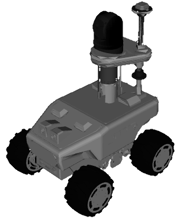
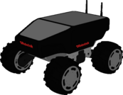
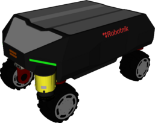
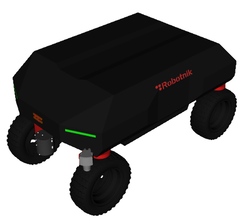
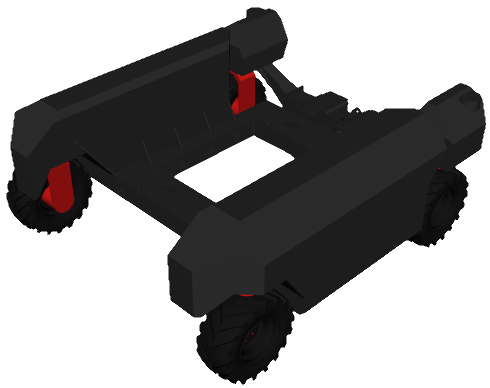
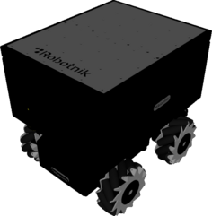
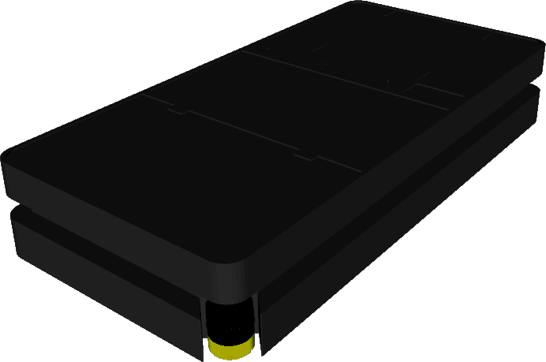
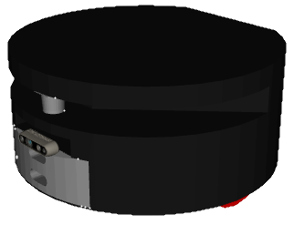
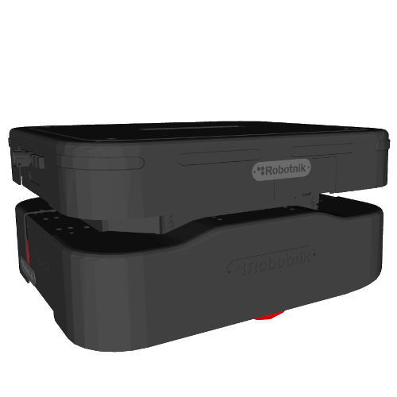
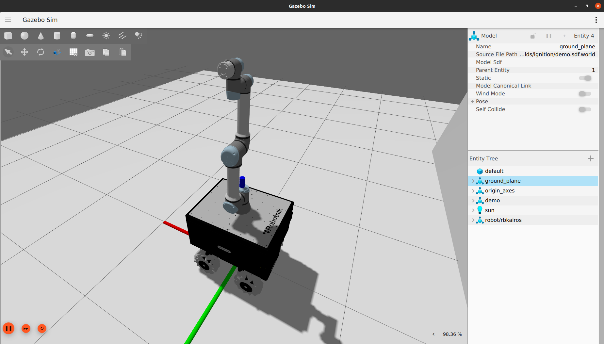

[![Contributors][contributors-shield]][contributors-url]
[![Forks][forks-shield]][forks-url]
[![Stargazers][stars-shield]][stars-url]
[![Issues][issues-shield]][issues-url]
[![License][license-shield]][license-url]
[![LinkedIn][linkedin-shield]][linkedin-url]

  

<h1 align="center"></h1>

## Overview
Simulation-based environments and launch assets for Robotnik platforms on ROS 2.

## Supported Robots

| Robot | Robot Model | Photo |
|-------|-------------|-------|
| [RB-Watcher](https://robotnik.eu/robotnik-robots/rb-watcher/) | rbwatcher |  |
| [RB-Summit-XL](https://robotnik.eu/robotnik-robots/rb-summit-xl/) | rbsummit |  |
| [RB-Vogui](https://robotnik.eu/robotnik-robots/rb-vogui/) | rbvogui, rbvogui_plus |  |
| [RB-Vogui-XL](https://robotnik.eu/robotnik-robots/rb-vogui-xl/) | rbvogui_xl |  |
| [RB-Fiqus](https://robotnik.eu/robotnik-robots/rb-fiqus/) | rbfiqus |  |
| [RB-Kairos](https://robotnik.eu/robotnik-robots/rb-kairos/) | rbkairos, rbkairos_plus |  |
| [RB-Robout](https://robotnik.eu/robotnik-robots/rb-robout/) | rbrobout, rbrobout_plus |  |
| [RB-1](https://robotnik.eu/robotnik-robots/rb-1/) | rb1 |  |
| [RB-Theron](https://robotnik.eu/robotnik-robots/rb-theron/) | rbtheron, rbtheron_plus |  |

## Simulator Gazebo (Ignition/Gazebo Sim)

This package provides simulation assets for Robotnik robots using Gazebo (Ignition/Gazebo Sim) simulator. To run simulations, refer to the instructions in the main README:

- [robotnik_gazebo_ignition](robotnik_gazebo_ignition/README.md)

## Contributing

Contributions are welcome.

1. Fork the repository
2. Create a feature branch: `git checkout -b feature/jazzy/AmazingFeature`
3. Commit: `git commit -m "Add AmazingFeature"`
4. Push: `git push origin feature/AmazingFeature`
5. Open a PR and describe your changes

Special thanks to all contributors!

## License

Distributed under **BSD-3**. See [`LICENSE`][license-url].

<!-- LINK REFS -->

[contributors-shield]: https://img.shields.io/github/contributors/RobotnikAutomation/robotnik_simulation.svg?style=for-the-badge
[contributors-url]: https://github.com/RobotnikAutomation/robotnik_simulation/graphs/contributors
[forks-shield]: https://img.shields.io/github/forks/RobotnikAutomation/robotnik_simulation.svg?style=for-the-badge
[forks-url]: https://github.com/RobotnikAutomation/robotnik_simulation/network/members
[stars-shield]: https://img.shields.io/github/stars/RobotnikAutomation/robotnik_simulation.svg?style=for-the-badge
[stars-url]: https://github.com/RobotnikAutomation/robotnik_simulation/stargazers
[issues-shield]: https://img.shields.io/github/issues/RobotnikAutomation/robotnik_simulation.svg?style=for-the-badge
[issues-url]: https://github.com/RobotnikAutomation/robotnik_simulation/issues
[license-shield]: https://img.shields.io/github/license/RobotnikAutomation/robotnik_simulation.svg?style=for-the-badge
[license-url]: https://github.com/RobotnikAutomation/robotnik_simulation/blob/master/LICENSE
[linkedin-shield]: https://img.shields.io/badge/-LinkedIn-black.svg?style=for-the-badge&logo=linkedin&colorB=555
[linkedin-url]: https://www.linkedin.com/company/robotnik-automation/
[product-screenshot]: docs/assets/img/ignition_simulation_view.png
