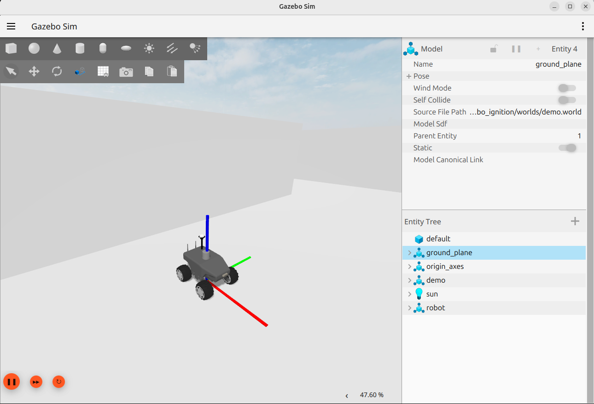
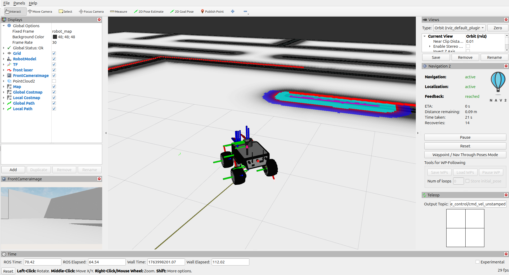

# Simulation



## Bringup

Launch complete simulation

```
ros2 launch  robotnik_simulation_bringup bringup_complete.launch.py robot_model:=rbsummit use_gui:=true use_rviz:=false
```

Launch complete simulation with MoveIt enabled:

```
ros2 launch robotnik_simulation_bringup bringup_complete.launch.py robot:=rbkairos robot_model:=rbkairos_plus arm_type:=ur10e use_gui:=true use_rviz:=true run_moveit:=true
```

#### Parameters
| Name | Required | Purpose | Example |
|---|---|---|---|
| `robot_id` | no | Name for launch and config resources | `robot` |
| `robot_model` | no | Name of the robot model | `rbsummit` |
| `use_gui` | no | Enable simulation graphical interface | `true` |
| `low_performance_simulation` | no | Enable smooth simulation for low performance computers | `true` |
| `use_rviz` | no | Launch rviz | `false` |
| `run_moveit` | no | Launch MoveIt stack after navigation startup | `false` |
| `arm_type` | no | Arm type used for robots with manipulator (forwarded as xacro `ur_type`) | `ur10e` |
| `world_path` | no | Path of the world file | `/path/worlds/demo.world` |

## MoveIt

MoveIt can be launched in two modes:

1. Integrated in bringup:

```
ros2 launch robotnik_simulation_bringup bringup_complete.launch.py robot:=rbkairos robot_model:=rbkairos_plus arm_type:=ur10e run_moveit:=true
```

2. Independently from the simulation bringup pipeline:

```
ros2 launch robotnik_simulation_moveit moveit.launch.py robot_id:=robot robot:=rbkairos robot_model:=rbkairos_plus moveit_config_name:=rbkairos_moveit_config arm_type:=ur10e run_moveit_rviz:=true
```

Launch rviz for visualization:

```
ros2 launch  robotnik_simulation_bringup rviz.launch.py
```



## Create and use a new map

### 1. Run simulation

Launch the demo world:

```
ros2 launch robotnik_gazebo_ignition spawn_world.launch.py gui:=true
```

Spawn the robot:

```
ros2 launch robotnik_gazebo_ignition spawn_robot.launch.py \
  robot:=rbsummit run_rviz:=false

# Robot with manipulator selecting arm model
ros2 launch robotnik_gazebo_ignition spawn_robot.launch.py \
  robot:=rbkairos robot_model:=rbkairos_plus arm_type:=ur10e run_rviz:=false
```

In case of `rbsummit` or `rbwatcher` run Pointcloud to Laserscan node

```
ros2 launch robotnik_simulation_bringup laser_filters.launch.py
```

### 2. Autonomous navigation 

Run localization:

```
ros2 launch robotnik_simulation_localization localization.launch.py
```

Load map:

```
ros2 service call /robot/map_server/load_map nav2_msgs/srv/LoadMap "map_url: '/home/robot/maps/demo_map/demo_map.yaml'" 
```

Run navigation:

```
ros2 launch robotnik_simulation_navigation navigation.launch.py
```

### 3. Mapping

Run mapping:

```
ros2 launch robotnik_simulation_localization localization.launch.py run_mapping:=true
```

Start mapping:

```
ros2 service call /robot/lifecycle_manager_mapping/manage_nodes nav2_msgs/srv/ManageLifecycleNodes "command: 0"
```

Save map:

```
ros2 service call /robot/map_saver/save_map nav2_msgs/srv/SaveMap "map_topic: '/robot/map'
map_url: '/home/robert/ws/sim/sim_ws/src/maps/test'
image_format: 'true'
map_mode: 'true'
free_thresh: 0.196
occupied_thresh: 0.65"
```