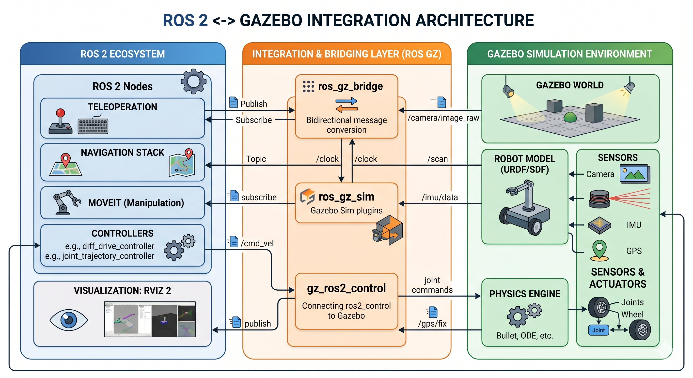
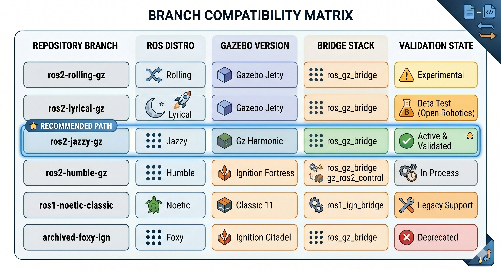
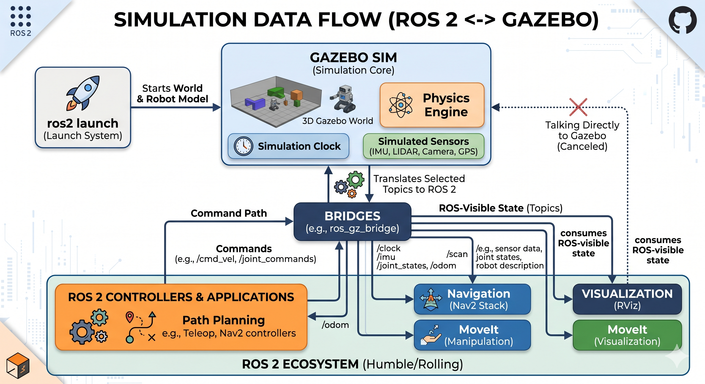

# ROS 2 + Gazebo in Robotnik Simulation

This document is a conceptual onboarding guide for understanding how ROS 2 and Gazebo interact inside `robotnik_simulation`.

It is not the canonical installation guide for any branch. For setup instructions, always follow the `README` of the branch and simulator package you are actually using.

In this repository, the operational guide for `${ROS-DISTRO}-devel` lives in [`../robotnik_gazebo_ignition/README.md`](../robotnik_gazebo_ignition/README.md).

## Why this document exists

The repository is maintained through ROS 2 distro branches, and Gazebo compatibility changes with each branch. That means two things are true at the same time:

- The simulation workflow is conceptually the same across branches.
- The exact Gazebo version, bridge packages, and compatibility constraints can change depending on the ROS 2 distribution.

This guide explains the common architecture first, and then clarifies where branch-specific differences appear.

## What Gazebo does in this repository

`robotnik_gazebo_ignition` is the simulation layer of this repository. Its responsibility is to:

- Launch Gazebo worlds.
- Spawn robot models into the simulator.
- Expose simulated sensors and time to ROS 2.
- Connect simulated actuators and controllers to ROS 2 control flows.

ROS 2 does not run "inside Gazebo". Instead, Gazebo runs the simulated world and the simulated robot entities, while ROS 2 nodes interact with that simulation through dedicated integration packages.

## How ROS 2 and Gazebo interact

At a high level, the integration is built around four roles:

| Component | Role in the system |
|---|---|
| `ros_gz_sim` | Starts or connects to Gazebo simulation processes and spawns entities. |
| `ros_gz_bridge` | Bridges topics and messages between Gazebo Transport and ROS 2. |
| `gz_ros2_control` | Connects Gazebo simulation with `ros2_control` interfaces and controllers. |
| ROS 2 nodes | Consume sensors, publish commands, plan motion, visualize state, and orchestrate behavior. |

### Example from this repository

The current integration can be traced directly in the launch files:

- [`../robotnik_gazebo_ignition/launch/spawn_world.launch.py`](../robotnik_gazebo_ignition/launch/spawn_world.launch.py) launches Gazebo and creates a bridge for `/clock`.
- [`../robotnik_gazebo_ignition/launch/spawn_robot.launch.py`](../robotnik_gazebo_ignition/launch/spawn_robot.launch.py) spawns the robot with `ros_gz_sim`, generates topic bridges for sensors with `ros_gz_bridge`, and prepares the control stack used by the simulated platform.

### Typical data flow

1. Gazebo runs the world and the robot physics.
2. The robot is spawned from its ROS-generated description.
3. Sensor topics produced in Gazebo are bridged into ROS 2.
4. ROS 2 controllers and application nodes publish commands.
5. Gazebo applies those commands to the simulated joints and robot body.

### ROS 2 <-> Gazebo architecture



## Naming and versioning: Ignition, Gazebo, Fortress and Harmonic

One source of confusion is that the simulator ecosystem has changed names over time.

- Older documentation often refers to **Ignition Gazebo**.
- Newer releases use the **Gazebo** name directly.
- In practice, you will still see a mix of names in package names, repository history, launch files, and documentation.

Within this repository, that naming transition appears in places such as:

- The package name `robotnik_gazebo_ignition`.
- Launch comments or variables that still mention "ignition".
- Dependencies that now use `ros_gz_*` or `gz_*` naming.

The important point for users is not just the name, but the compatibility set:

- ROS 2 distro
- Gazebo release
- Bridge packages
- Control integration packages
- Repository branch

Those pieces must be treated as a coherent combination.

## Compatibility by branch

The recommended setup is branch-specific. Each branch should document and validate its own Gazebo combination.

| Repository branch | ROS 2 distro | Gazebo version | Key integration packages | Expected status |
|---|---|---|---|---|
| `jazzy-devel` | Jazzy | Harmonic | `ros_gz_sim`, `ros_gz_bridge`, `gz_ros2_control` | Current documented path |
| `humble-devel` | Humble | To be documented in its branch README | `ros_gz_*` / Gazebo integration may differ by packaging choice | Branch-specific validation required |

This table is intentionally conservative: it should reflect validated branch guidance, not every theoretical combination that might compile.

### Branch compatibility matrix



## Common incompatibilities and why they happen

The most frequent problems come from mixing layers that were not meant to be combined.

### 1. Mixing branches and package sets

Examples:

- Using the `jazzy-devel` manifest with a different ROS 2 distro.
- Installing system packages from one Gazebo integration path and source dependencies from another.
- Reusing deb packages generated for one branch inside a different branch workflow.

Why this fails:

- Message bridges may differ.
- Control integration packages may expect different APIs.
- Dependency versions pinned in manifests can diverge.

### 2. Gazebo bridge package conflicts

Some ROS 2 distributions expose multiple Gazebo integration package paths, and they are not always interchangeable.

The historical Humble note that motivated this document is a good example:

- `ros-humble-ros-gzharmonic` can conflict with `ros-humble-ros-gz*` package sets.

This is exactly the kind of branch-specific incompatibility that should live in the operational README of the relevant branch, while this document explains the general reason: Gazebo integration packages must be installed as one coherent family.

### 3. Control stack mismatches

`gz_ros2_control` is the bridge between Gazebo and `ros2_control`. If Gazebo, the ROS 2 distro, or the controller stack drift apart, symptoms usually appear as:

- Controllers failing to load.
- Commands being accepted in ROS 2 but not reflected in simulation.
- Joint interfaces not appearing as expected.

### 4. Topic and message translation assumptions

Gazebo and ROS 2 do not use the same middleware or native message types. `ros_gz_bridge` handles that translation, but only for configured topic/message pairs.

If a topic is not bridged, ROS 2 will not see it even if Gazebo is publishing it correctly.

## How to choose the right combination

For most users, the safest rule is simple:

1. Start from the repository branch you need.
2. Follow the simulator README from that branch.
3. Use the dependency manifest documented by that branch.
4. Do not mix debs, manifests, or Gazebo package families from different branches.

### Practical decision guide

| If your goal is... | Use this approach |
|---|---|
| Run the current `jazzy-devel` simulation | Follow [`../robotnik_gazebo_ignition/README.md`](../robotnik_gazebo_ignition/README.md) |
| Understand how the ROS 2 <-> Gazebo integration works | Read this document first, then the branch README |
| Port the setup to another ROS 2 branch | Reuse the architecture, but validate the Gazebo/package combination in that branch |
| Debug bridge or control issues | Inspect the relevant launch files and verify the exact integration packages used in that branch |

## Guided examples

These examples are intentionally short. Their goal is to show which subsystem is doing what, not to replace the installation guide.

### Example 1: Launching a world

Command:

```bash
ros2 launch robotnik_gazebo_ignition spawn_world.launch.py world:=empty
```

What happens conceptually:

- Gazebo starts and loads the selected world.
- `ros_gz_sim` handles the simulation launch process.
- A `/clock` bridge is created so ROS 2 can use simulation time.

What belongs to Gazebo:

- World loading
- Physics
- Rendering
- Simulated clock source

What belongs to ROS 2:

- Launch orchestration
- ROS-side `/clock` consumption

### Example 2: Spawning a robot

> **Important**: `spawn_robot.launch.py` requires an active Gazebo simulation. Launch a world first and keep it running before trying to spawn a robot. The robot spawn command does not start Gazebo by itself.

Command:

```bash
ros2 launch robotnik_gazebo_ignition spawn_robot.launch.py robot:=rbwatcher
```

What happens conceptually:

- ROS 2 prepares the robot description and runtime parameters.
- `ros_gz_sim` creates the simulated entity inside Gazebo.
- `ros_gz_bridge` exposes selected sensor topics into ROS 2.

What belongs to Gazebo:

- Robot entity in the world
- Sensor simulation
- Joint and body dynamics

What belongs to ROS 2:

- Robot description pipeline
- Topic bridges
- Downstream consumers such as RViz or teleop

### Example 3: Sending commands to the simulated robot

Typical command path:

- A ROS 2 node publishes velocity or controller commands.
- ROS 2 controllers process those commands.
- `gz_ros2_control` maps them into the simulated robot interfaces.
- Gazebo applies them to the robot in the simulation step.

This is why a robot can appear correctly in Gazebo but still fail to move if the control layer is misconfigured.

### Simulation data flow



## What to inspect when something breaks

If the integration is not behaving as expected, the fastest checks are usually:

- Confirm the active branch and its documented Gazebo version.
- Confirm the dependency manifest used for that branch.
- Confirm the installed Gazebo/ROS integration packages belong to one consistent family.
- Check whether the missing topic is a Gazebo-native topic, a ROS 2 topic, or a bridge configuration problem.
- Check whether the failure is in spawning, bridging, controller loading, or application-layer behavior.

## References inside this repository

- Operational setup for `jazzy-devel`: [`../robotnik_gazebo_ignition/README.md`](../robotnik_gazebo_ignition/README.md)
- World launch integration: [`../robotnik_gazebo_ignition/launch/spawn_world.launch.py`](../robotnik_gazebo_ignition/launch/spawn_world.launch.py)
- Robot spawning and bridge generation: [`../robotnik_gazebo_ignition/launch/spawn_robot.launch.py`](../robotnik_gazebo_ignition/launch/spawn_robot.launch.py)
- Current dependency manifest for `jazzy-devel`: [`../dependencies/repos/robotnik_simulation.repos`](../dependencies/repos/robotnik_simulation.repos)

## Summary

The key idea is to think in layers:

- Gazebo simulates the world and robot physics.
- ROS 2 runs the application, control, visualization, and planning stack.
- Bridges and control adapters connect both sides.
- Branch, ROS distro, Gazebo version, and dependency set must always be treated as one validated combination.
