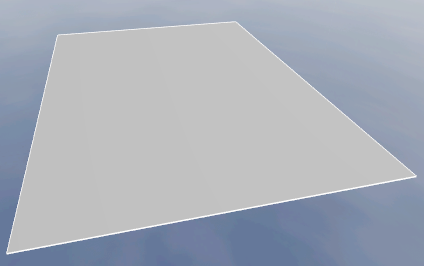
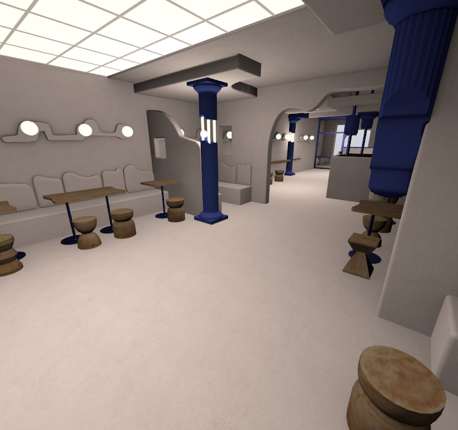
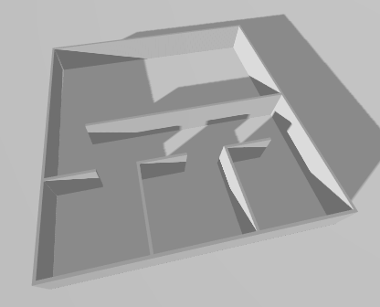
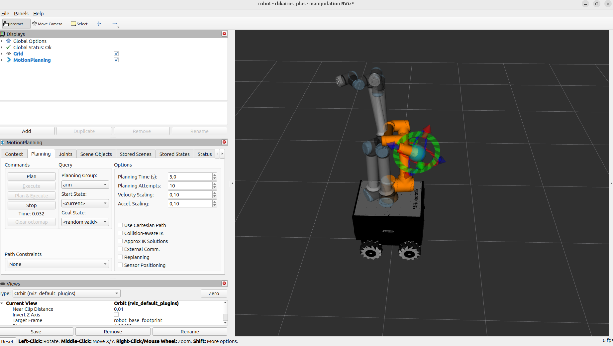

# Robotnik Gazebo Ignition


This package provides the Gazebo-based simulation layer for Robotnik robots on ROS 2. It includes world launching, robot spawning, ROS 2 <-> Gazebo bridges, control integration and auxiliary simulation resources.

> **Branch-specific guide**: `robotnik_gazebo_ignition` is maintained across ROS 2 distro branches, but the Gazebo version changes with each branch. This README documents only the validated workflow for `jazzy-devel`: ROS 2 Jazzy + Gazebo Harmonic. For conceptual background about architecture, compatibility and versioning, see [`../docs/ros2-gazebo-compatibility.md`](../docs/ros2-gazebo-compatibility.md).

## What this package includes

- Gazebo world launch files
- Robot spawn launch files
- ROS 2 <-> Gazebo topic bridging
- `gz_ros2_control` integration for simulated control
- RViz resources and simulation control profiles

## Installation

### General requirements

Before following the branch-specific steps below, make sure you have:

- ROS 2 Jazzy installed
- `curl`, `gnupg`, `vcs`, `rosdep` and `colcon` available
- permission to install Gazebo and ROS 2 packages from apt

This README documents the manual installation path currently validated for this branch.

### Jazzy-specific installation

1. Set up the Gazebo package repository:

```bash
# Run on a machine with ROS 2 Jazzy already installed
sudo apt update
sudo apt-get install curl lsb-release gnupg
sudo curl https://packages.osrfoundation.org/gazebo.gpg --output /usr/share/keyrings/pkgs-osrf-archive-keyring.gpg
echo "deb [arch=$(dpkg --print-architecture) signed-by=/usr/share/keyrings/pkgs-osrf-archive-keyring.gpg] http://packages.osrfoundation.org/gazebo/ubuntu-stable $(lsb_release -cs) main" | sudo tee /etc/apt/sources.list.d/gazebo-stable.list > /dev/null
```

2. Install Gazebo Harmonic:

```bash
# Run after adding the Gazebo package repository
sudo apt-get update
sudo apt-get install gz-harmonic
```

3. Create the workspace and import the canonical repository manifest for `jazzy-devel`:

```bash
# Run from your home directory to create and populate the workspace
mkdir -p ~/ros2_ws/src
cd ~/ros2_ws

vcs import --input https://raw.githubusercontent.com/jlgalanRB/robotnik_simulation/refactor/jazzy/install-docs-dependencies/dependencies/repos/robotnik_simulation.repos src/
```

4. Install ROS 2 runtime dependencies:

```bash
# Run on the target machine to install manual runtime extras
sudo apt-get update

# Gazebo system library
sudo apt-get install -y \
  libgz-sim8-dev

# Navigation stack convenience metapackage
sudo apt-get install -y \
  ros-jazzy-navigation2

# MoveIt planning extras not yet covered by the current package manifests
sudo apt-get install -y \
  ros-jazzy-chomp-motion-planner* \
  ros-jazzy-kdl* \
  ros-jazzy-ompl* \
  ros-jazzy-pick-ik* \
  ros-jazzy-pilz-industrial-motion-planner* \
  ros-jazzy-trac-ik* \
  ros-jazzy-stomp* \
  ros-jazzy-spacenav* \
  ros-jazzy-warehouse-ros-sqlite*

# Universal Robots support
sudo apt-get install -y \
  ros-jazzy-ur-simulation-gz \
  ros-jazzy-ur-description
```

5. Install the Robotnik-specific prebuilt debs shipped in this repository:

```bash
# Run from the repository root inside the workspace
cd ~/ros2_ws/src/robotnik/robotnik_simulation
sudo apt-get install -y ./debs/ros-jazzy-*.deb
```

6. Resolve remaining dependencies:

```bash
# Run from the workspace root after importing all repositories
source /opt/ros/jazzy/setup.bash
cd ~/ros2_ws
rosdep update
rosdep install --from-paths src --ignore-src -r -y
```

7. Build the workspace:

```bash
# Run from the workspace root to build and source the environment
cd ~/ros2_ws
colcon build --symlink-install
source install/setup.bash
```

## Quick start

Once the installation is complete and the workspace is built, this is the minimum validated flow to check that the simulation is working.

> **Important**: `spawn_robot.launch.py` requires an active Gazebo simulation. Launch a world first and keep it running. The robot spawn command does not start Gazebo by itself.

Terminal 1:

```bash
# Run in a dedicated terminal after building the workspace
source ~/ros2_ws/install/setup.bash
ros2 launch robotnik_gazebo_ignition spawn_world.launch.py world:=empty
```

Terminal 2:

```bash
# Run in a second terminal while Gazebo is already running
source ~/ros2_ws/install/setup.bash
ros2 launch robotnik_gazebo_ignition spawn_robot.launch.py robot:=rbwatcher
```

## Usage

### Spawn World

This is the first operational step in the simulation flow. It launches Gazebo and loads the selected world.

#### Basic

```bash
# Run after sourcing the workspace and with no robot spawned yet
ros2 launch robotnik_gazebo_ignition spawn_world.launch.py world:=empty

# Run to start the same world without the Gazebo GUI
ros2 launch robotnik_gazebo_ignition spawn_world.launch.py world:=empty gui:=false
```

#### Advanced

```bash
# Run after sourcing the workspace to launch any available world
ros2 launch robotnik_gazebo_ignition spawn_world.launch.py world:=<world_name> gui:=<true|false>
```

#### Parameters

| Name | Required | Purpose | Example |
|---|---|---|---|
| `world` | no | Name of the world file without the `.world` extension | `empty` |
| `world_path` | no | Full path to a custom world file; overrides `world` | `/path/to/custom_world.sdf` |
| `gui` | no | Enable or disable Gazebo GUI | `true` or `false` |

#### Supported worlds

| Name | Description | Thumbnail |
|---|---|---|
| `empty` | Empty world with a flat ground plane |  |
| `demo` | Demo world with obstacles and ramps for navigation testing |  |
| `ionic` | Demo world from Gazebo showing Ionic simulation features |  |
| `lightweight_scene` | Lightweight scene for performance testing |  |

### Spawn Robot

This launch file inserts a robot into an already running Gazebo simulation.

> **Important**: `spawn_robot.launch.py` does not launch Gazebo. A world must already be active before spawning a robot.

#### Basic

```bash
# Run after Gazebo is already running to spawn the default RB-Watcher
ros2 launch robotnik_gazebo_ignition spawn_robot.launch.py robot:=rbwatcher

# Run to spawn the robot with a custom namespace and pose
ros2 launch robotnik_gazebo_ignition spawn_robot.launch.py \
  robot_id:=robot_a \
  robot:=rbwatcher \
  robot_model:=rbwatcher \
  x:=0.0 y:=0.0 z:=0.0 \
  run_rviz:=true

# Run to spawn a mobile manipulator variant with a specific arm
ros2 launch robotnik_gazebo_ignition spawn_robot.launch.py \
  robot:=rbkairos \
  robot_model:=rbkairos_plus \
  arm_type:=ur10e \
  run_rviz:=true
```

#### Advanced

```bash
# Run after Gazebo is active to spawn any supported robot configuration
ros2 launch robotnik_gazebo_ignition spawn_robot.launch.py \
  robot_id:=<unique_name> \
  robot:=<robot_type> \
  robot_model:=<robot_model> \
  arm_type:=<ur_model> \
  x:=<m> y:=<m> z:=<m> \
  has_arm:=<true|false> \
  run_rviz:=<true|false> \
  rviz_config:=<path/to/config.rviz>
```

#### Parameters

| Name | Required | Purpose | Example |
|---|---|---|---|
| `robot_id` | no | Instance name for the spawned robot | `robot_a` |
| `robot` | no | Robot type to spawn; default is `rbwatcher` | `rbwatcher` |
| `robot_model` | no | Specific model within the selected robot type | `rbwatcher` |
| `x` `y` `z` | no | Spawn position in meters | `0.0 0.0 0.0` |
| `run_rviz` | no | Launch RViz2 with a predefined configuration | `true` or `false` |
| `rviz_config` | no | Full path to a custom RViz2 config; overrides the default | `/path/to/custom_config.rviz` |
| `has_arm` | no | Whether the platform should be spawned with a robotic arm | `true` or `false` |
| `arm_type` | no | Arm type forwarded to the robot xacro as `ur_type` | `ur10e` |

#### Supported robots

| robot | robot_model options | Notes |
|---|---|---|
| `rbwatcher` | `rbwatcher` | Supported |
| `rb1` | `rb1` | Limited |
| `rbfiqus` | `rbfiqus` | Limited |
| `rbkairos` | `rbkairos`, `rbkairos_plus` | Limited |
| `rbrobout` | `rbrobout`, `rbrobout_plus` | Limited |
| `rbsummit` | `rbsummit` | Limited |
| `rbsummit_steel` | `rbsummit_steel` | Limited |
| `rbtheron` | `rbtheron`, `rbtheron_plus` | Limited |
| `rbvogui` | `rbvogui`, `rbvogui_plus` | Limited |
| `rbvogui_xl` | `rbvogui_xl` | Limited |

`Limited` means the robot has been integrated but may still require additional validation or tuning for some workflows.

#### Robot type vs robot model

Description package is [robotnik_description](https://github.com/RobotnikAutomation/robotnik_description), which contains all robot types and models. The distinction is:

- **Robot type**: Category such as `rbwatcher`, `summit_xl`. See the package `robots/` folder for available types. [List of supported robots](https://github.com/RobotnikAutomation/robotnik_description/tree/jazzy-devel/robots).
- **Robot model**: Concrete variant inside a type. If omitted, the default model for that type is used. See the package `robots/<robot>/models/` folder for available models. [Example models for rbwatcher](https://github.com/RobotnikAutomation/robotnik_description/tree/jazzy-devel/robots/rbwatcher).

#### Notes

- Use a unique `robot_id` when spawning multiple robots in the same world to avoid name conflicts in topics and frames.

## Control the robot

After spawning the robot, you can control it using command velocity messages. The two main topics for controlling the robot are:

- `/<robot-id>/robotnik_base_control/cmd_vel`: This topic is used to send velocity commands to the robot. The messages should be of type `geometry_msgs/msg/TwistStamped`.
- `/<robot-id>/robotnik_base_control/cmd_vel_unstamped`: This topic is used to send velocity commands without a timestamp. The messages should be of type `geometry_msgs/msg/Twist`.

Example with `teleop_twist_keyboard`:

```bash
# Run in another terminal after the robot is already spawned
sudo apt install ros-jazzy-teleop-twist-keyboard

ros2 run teleop_twist_keyboard teleop_twist_keyboard \
  --ros-args \
  -r cmd_vel:=/robot/robotnik_base_control/cmd_vel \
  -p stamped:=true
```

Replace `/robot/robotnik_base_control/cmd_vel` with the correct namespace for the `robot_id` you used when spawning the robot.

You can also use the RViz teleoperation panel shown on the bottom right when the `ros-visualization/visualization_tutorials` plugin is available in the workspace.

> **Important**: the current RViz teleoperation plugin is known to publish zero-velocity commands while it remains active. This can interfere with other command sources and make the panel counterproductive in some workflows, especially when another teleoperation or navigation source is active at the same time.

> **Planned change**: this behavior will be revisited in a future update. The current intention is to replace the existing RViz teleoperation panel with a Robotnik-specific plugin better adapted to the supported control flow.

## MoveIt compatibility

It is possible to use [MoveIt](https://moveit.picknik.ai/main/index.html) to control robotic arms mounted on supported platforms.

> **Important**: MoveIt support currently works correctly only with `robot_id:=robot`. If a different `robot_id` is used, interaction with `move_group` from RViz2 is not supported.

MoveIt can be launched in two ways:

1. From `robotnik_simulation_bringup` using `run_moveit:=true`
2. Independently from `robotnik_simulation_moveit`

Example from bringup:

```bash
# Run after the simulation is active if you want integrated MoveIt bringup
ros2 launch robotnik_simulation_bringup bringup_complete.launch.py \
  robot:=rbkairos \
  robot_model:=rbkairos_plus \
  arm_type:=ur10e \
  run_moveit:=true \
  use_rviz:=true
```

Example standalone:

```bash
# Run after the robot and controllers are already running in simulation
ros2 launch robotnik_simulation_moveit moveit.launch.py \
  robot_id:=robot \
  robot:=rbkairos \
  robot_model:=rbkairos_plus \
  arm_type:=ur10e \
  moveit_config_name:=rbkairos_moveit_config \
  run_moveit_rviz:=true
```

Example standalone with custom `robot_xacro_path`:

```bash
# Run after the robot and controllers are already running, using a custom robot description
ros2 launch robotnik_simulation_moveit moveit.launch.py \
  robot_id:=robot \
  robot:=rbkairos \
  robot_model:=rbkairos_plus \
  robot_xacro_path:=/path/to/robot.urdf.xacro \
  arm_type:=ur10e \
  moveit_config_name:=rbkairos_moveit_config \
  run_moveit_rviz:=true
```



Currently documented mobile manipulation platforms:

- `rbkairos`
- `rbrobout` including lift variants
- `rbtheron`
- `rbvogui`
- `rbfiqus` bi-arm setup (WIP)

For the standalone MoveIt flow and its parameters, see [`../common/robotnik_simulation_moveit/README.md`](../common/robotnik_simulation_moveit/README.md).

## Customization

### Edit the robot model

Specific robot models can be customized by creating your own URDF/XACRO files based on the existing ones in `robotnik_description`.

1. Copy the existing robot folder from `robotnik_description/robots/<robot>/` into a new custom folder.
2. Modify the URDF/XACRO files to add or adapt components.
3. Update any required configuration files for sensors, arms or other components.
4. Spawn the customized robot using `robot_xacro_path`.

Example:

```bash
# Run after Gazebo is active to spawn a customized robot variant
ros2 launch robotnik_gazebo_ignition spawn_robot.launch.py \
  robot:=rbkairos \
  robot_model:=rbkairos_plus \
  arm_type:=ur10e
```

With custom `robot_xacro_path`:

```bash
# Run after Gazebo is active to spawn a robot from your custom XACRO path
ros2 launch robotnik_gazebo_ignition spawn_robot.launch.py \
  robot_xacro_path:=/path/to/your_robot.urdf.xacro
```

### Custom control configuration

The package includes control profiles under `robotnik_gazebo_ignition/config/profile`. These profiles can be used to adjust topics, frames, velocities and controller settings for different Robotnik robots.

## Troubleshooting

- The robot does not appear in the simulation:
  confirm that a Gazebo world is already running before launching `spawn_robot.launch.py`.
- The expected ROS 2 topics are missing:
  review the selected `robot_id`, the namespace in use and the active bridges.
- MoveIt does not connect or interact correctly:
  confirm that the robot was launched with `robot_id:=robot`.
- The robot does not respond to control commands:
  review the control topics, the selected controller setup and the active simulation state.

## Docker

🚧 Work in progress. 🚧

Docker support is still under review and should not yet be considered the recommended setup path for this branch.

## Related documentation

- Conceptual ROS 2 + Gazebo guide: [`../docs/ros2-gazebo-compatibility.md`](../docs/ros2-gazebo-compatibility.md)
- Integrated simulation bringup: [`../common/robotnik_simulation_bringup/README.md`](../common/robotnik_simulation_bringup/README.md)
- Standalone MoveIt flow: [`../common/robotnik_simulation_moveit/README.md`](../common/robotnik_simulation_moveit/README.md)
